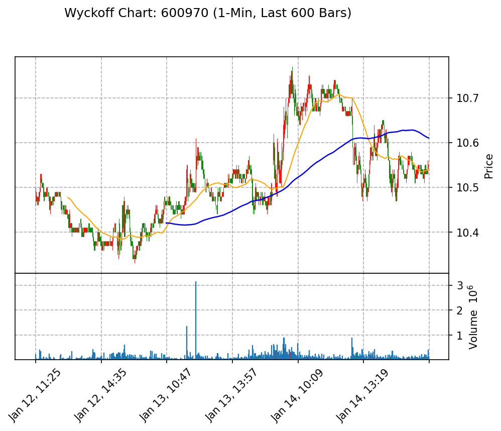

# 威科夫分析报告

## 1. Background (位置与趋势)
当前微观结构显示出吸筹的特征。尽管价格在10.55附近波动，但成交量的变化表明买方在逐步积累。整体供求关系上，买方占优，尤其在价格下跌至10.48时，成交量有所增加，显示出买盘的支持。

## 2. Key Events (关键行为)
- **SC (Selling Climax)**: 在13:16时，价格下探至10.48，伴随较大的成交量（440,000），这是一个卖压减弱的信号。
- **LPS (Last Point of Support)**: 在13:19时，价格回升至10.52，成交量（220,100）支持了这一反弹，表明买方在此价位有较强的支撑意愿。
- **Stopping Action**: 在14:00时，价格在10.52附近反复震荡，成交量（118,200）相对较小，显示出市场暂时的平衡状态。

结合“努力与结果”的分析，尽管价格有小幅波动，但在关键支撑位的成交量增加表明买方努力在逐步增强，而价格未能继续下跌，显示出卖方的力量正在减弱。

## 3. Trade Plan (交易计划)
- **做多信号**: 如果价格突破10.61并伴随较大成交量（例如超过300,000），则可考虑做多。
- **做空信号**: 如果价格跌破10.48且成交量显著增加（例如超过400,000），则可考虑做空。
- **止损位**: 做多时，止损位设定在10.48；做空时，止损位设定在10.62。

通过以上分析，当前市场呈现出吸筹的特征，买方力量逐渐增强，适合在确认信号后进行交易。